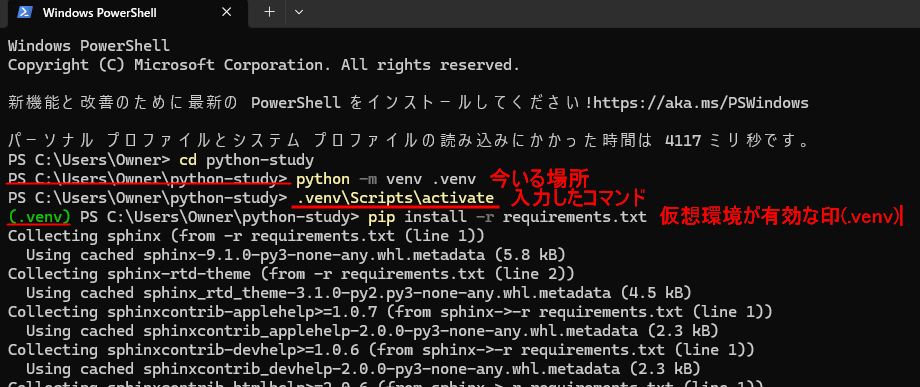

4月：コンピュータの基礎・環境設定
==================================

テーマ
------

ターミナルとお友達になろう／学習準備／Git超入門（init・add・commit）

この回のねらい
--------------

これからPythonを学んでいくために必要な、最初の開発環境を整えます。

4月は、次の3つを体験することを目標にします。

- ターミナルを使って、基本的な操作ができるようになる
- Pythonの仮想環境を作って、有効化・無効化できるようになる
- Gitで ``init`` ``add`` ``commit`` の流れを体験する

内容
----

1. ターミナル（コマンドライン）の基礎
~~~~~~~~~~~~~~~~~~~~~~~~~~~~~~~~~~~~~~~~~
コンピュータの仕組みとプログラム
^^^^^^^^^^^^^^^^^^^^^^^^^^^^^^^^^^

コンピュータを動かすには、「何を、どの順番で行うか」を指示する必要があります。
その命令の集まりを「プログラム」と呼びます。
私たちはプログラムを書いて、コンピュータに処理の手順を伝えます。

コンピュータの中では、入力された命令やデータが、
CPU、主記憶装置、補助記憶装置、入力装置、出力装置のあいだを移動しながら処理されます。

.. image:: ../_images/computer.svg
   :alt: コンピュータの制御とデータの流れ
   :width: 80%
   :align: center

.. note::

   図の赤い矢印は「制御の流れ」、青い矢印は「データの流れ」を表しています。
   制御の流れは「どこに何をさせるか」という指示、
   データの流れは「実際にやり取りされる情報」です。

コンピュータとの対話方法
^^^^^^^^^^^^^^^^^^^^^^^^

私たちは、こうしたコンピュータに対して、操作や命令を通して指示を出します。
コンピュータとの対話方法には、大きく 2 つあります。

- **GUI（Graphical User Interface）**  
  画面のボタンやアイコンを、マウスなどで操作する方法
- **CLI（Command Line Interface）**  
  キーボードでコマンドを入力して操作する方法

ふだんのパソコン操作では GUI を使うことが多いですが、
開発では CLI を使って細かい指示を出す場面がよくあります。

.. image:: ../_images/gui_cli_comparison.svg
   :alt: GUI と CLI の違い
   :width: 85%
   :align: center

たとえば、GUI ではファイルをドラッグ＆ドロップして移動できます。
CLI では、コマンドを入力して同じ操作を行います。

- Windows PowerShell: ``Move-Item script.py project_folder``
- Mac / Linux: ``mv script.py project_folder/``

このように、GUI と CLI はどちらもコンピュータに指示を出す方法ですが、
開発では CLI のほうが細かく正確な操作をしやすい場面が多くあります。

ターミナルとは
^^^^^^^^^^^^^^

ターミナルとは、CLI を使ってコンピュータに指示を出すための画面です。
ここにコマンドを入力して、ファイル操作やプログラムの実行を行います。

たとえば、ターミナルでは次のようなことができます。

- フォルダを移動する
- ファイルの一覧を見る
- 新しいフォルダを作る
- Pythonプログラムを実行する
- Gitで変更を記録する

ターミナルには、今どこで作業しているかを表す表示や、
入力したコマンド、実行結果が順番に表示されます。

.. note::

   ターミナルは「コマンドを入力する画面」、
   PowerShell や zsh（ズィーシェル）は
   「そのコマンドを受け取って実行する仕組み（シェル）」です。

2. 学習準備：Python環境を整える
~~~~~~~~~~~~~~~~~~~~~~~~~~~~~~~

**2.1 Pythonのインストール確認**

まず、Pythonが使えるか確認します。

.. code-block:: bash

   python --version

``Python 3.x.x`` と表示されれば、Pythonがインストールされていて使える状態です。

Pythonが見つからない場合は、公式サイトからインストールしてください。

- `Python公式サイト <https://www.python.org/>`_

**2.2 Pythonの対話モードを試す**

Pythonは、対話モードでその場ですぐに試すことができます。

ターミナルで次のように入力してみましょう。

.. code-block:: bash

   python

すると、Pythonの対話モードが始まります。  
たとえば、次のような計算をその場で試すことができます。

.. code-block:: python

   1 + 2
   3 * 4
   (10 - 2) / 4

このように、対話モードは簡単な確認や試し書きに便利です。

終了するときは、次のように入力します。

.. code-block:: python

   exit()

**2.3 Pythonファイルを作って実行してみる**

対話モードでは、その場で簡単な計算や確認ができます。  
一方で、まとまった処理を残したり、あとでもう一度実行したりしたいときは、  
プログラムを **ファイルとして保存して実行する** ほうが便利です。

ここでは、``day.py`` というファイルを作って実行してみましょう。

.. code-block:: python

   from datetime import date

   today = date.today()
   target = date(today.year, 6, 6)
   delta = (target - today).days

   print(f"6月6日Python Boot Campまであと{delta}日です")

このプログラムでは、今日の日付を取得し、  
今年の 6 月 6 日まであと何日あるかを計算して表示しています。

:nekochan:`yoshi-nya` やってみるニャ

1. メモ帳やテキストエディタを使って、上のコードを ``day.py`` という名前で保存します。
2. 保存場所は、ターミナルを開いたときの作業スペース（ホームディレクトリなど）にしておきます。（例：Windowsなら ``C:\Users\YourName``、Mac/Linuxなら ``/home/yourname`` など）
3. 保存する時に、ファイルの種類を「すべてのファイル」にして、拡張子が ``.py`` になるようにします。

:nekochan:`memo-nya` メモ

それぞれの行では、次のようなことをしています。

- ``from datetime import date``  
  日付を扱うための ``date`` を読み込んでいます。
- ``today = date.today()``  
  今日の日付を取得しています。
- ``target = date(today.year, 6, 6)``  
  今年の 6 月 6 日の日付を作っています。
- ``delta = (target - today).days``  
  2つの日付の差を日数で求めています。
- ``print(...)``  
  計算した結果を画面に表示しています。

ファイルを保存したら、ターミナルで次のように実行します。

.. code-block:: bash

   python day.py

実行すると、その日によって異なる日数が表示されます。

このように、Pythonではプログラムをファイルとして保存しておくことで、  
あとで何度でも実行したり、少しずつ書き足したりしやすくなります。

.. note::
   Pythonで処理を行うときは、ライブラリに含まれるモジュールの中のクラスや関数を使います。

   たとえば日付処理で使う datetime はモジュールです。
   その中には date、time、datetime、timedelta などのクラスがあります。

   date クラスは日付を表すインスタンスを作ります。
   たとえば date(2026, 6, 6) と書くと、2026-06-06 という日付のインスタンスが作られます。

   time は時刻、datetime は日付と時刻の両方を表すインスタンスを作ります。
   このように、どのクラスを使うかによって、作られるインスタンスの内容が変わります。

   import datetime as dt とすると、datetime モジュール全体を dt という別名で読み込みます。
   そのため、dt.date、dt.time、dt.datetime のように、モジュール内の複数のクラスを使えます。

   一方、from datetime import date とすると、datetime モジュールの中から date クラスだけを取り出して使えます。
   この場合は date(...) や date.today() のように、dt. を付けずに書けます。

   import datetime as dt は、モジュールごと読み込む書き方
   from datetime import date は、必要なクラスだけ取り出す書き方
   
   クラスだけをインポートすることもできるし、モジュール全体をインポートすることもできますが、
   今回は date だけを使うので、from datetime import date のほうがすっきりしています。

.. figure:: ../_images/module.svg
   :alt: モジュール・クラス・インスタンスの関係
   :width: 50%
   :align: center

**2.4 ライブラリと仮想環境について知る**

Python では、さまざまな機能をもつ **ライブラリ** を利用できます。
ライブラリは機能ごとに分かれたモジュールの集まりで、pythonのプログラムから呼び出して使います。
最初から Python に含まれている標準ライブラリもあれば、あとから自分でインストールして使う外部のライブラリもあります。

ただし、プロジェクトによって必要なライブラリは異なります。  
あるプロジェクトでは必要なものが、別のプロジェクトでは不要なこともあります。

そこで使うのが、**仮想環境** という仕組みです。

仮想環境は、ひとことでいうと  
**そのプロジェクト専用の Python の作業スペース** のようなものです。

これを使うと、別のプロジェクトで使っているライブラリと混ざりにくくなり、  
安心して学習や開発を進めやすくなります。

.. image:: ../_images/virtualenv.svg
   :alt: 仮想環境のイメージ
   :width: 40%
   :align: center

**2.5 作業用フォルダを作る**

では、今回の学習で使う作業スペースを作っていきましょう。  
学習用のフォルダとして ``python-study`` を作ります。

.. code-block:: bash

   mkdir python-study
   cd python-study

``mkdir`` は *make directory* の略で、新しいフォルダを作るコマンドです。  
``cd`` は *change directory* の略で、フォルダを移動するコマンドです。

この ``python-study`` フォルダの中で、これから Python の学習を進めていきます。

:nekochan:`yoshi-nya` やってみるニャ

**2.6 仮想環境を作成する**

次に、この ``python-study`` フォルダの中に仮想環境を作ります。

.. code-block:: bash

   python -m venv .venv

このコマンドは、``.venv`` という名前の仮想環境を作成します。

``.venv`` は仮想環境によく使われる名前のひとつです。  
特別な決まりではありませんが、  
「これは仮想環境のフォルダです」と分かりやすいため、よく使われています。

**2.7 仮想環境を有効化する**

利用している環境ごとにコマンドが異なります。

*Windows (PowerShell)*

.. code-block:: powershell

   .\.venv\Scripts\Activate.ps1

*Windows (コマンドプロンプト)*

.. code-block:: bash

   .venv\Scripts\activate.bat

*Mac/Linux*

.. code-block:: bash

   source .venv/bin/activate

有効化すると、ターミナルの先頭に ``(.venv)`` と表示されます。

**2.8 仮想環境の中でPythonを確認する**

仮想環境を有効化したら、その環境で Python が使えることを確認してみましょう。

.. code-block:: bash

   python --version

必要に応じて、インストールされているパッケージの一覧も確認できます。

.. code-block:: bash

   pip list

このように、仮想環境の中では、そのプロジェクト用の Python やライブラリを管理していきます。

**2.9 仮想環境を終了する**

作業が終わったら、仮想環境を終了できます。

.. code-block:: bash

   deactivate

参考：

- `Python公式 venv <https://docs.python.org/ja/3/library/venv.html>`_

3. Git超入門：変更を記録してみる
~~~~~~~~~~~~~~~~~~~~~~~~~~~~~~~~

Gitとは
^^^^^^^^

プログラムを書いていると、あとから内容を書き換えたり、動かなくなって直したりすることがあります。
そのときに、**いつ・どのように変更したか** を記録しておけると安心です。

Git は、ファイルの変更履歴を記録するための仕組みです。
「どこを変えたか」「いつの状態に戻したいか」を管理できるので、開発の土台になります。

**3.1 Gitがなぜ大切か**

たとえば、プログラムを書いていて次のようなことはよくあります。

- さっきまで動いていたのに、今は動かなくなった
- どこを変更したのか分からなくなった
- 前の状態に戻したくなった
- 複数のファイルを安心して書き換えたい

Git を使うと、こうした変更を記録しながら作業できます。
そのため、プログラミングではとてもよく使われています。

「前の状態を残すだけ」なら、ファイルをコピーして保存する方法もあります。
たとえば、``xxx_v1``、``xxx_v2`` のように名前を変えて保存することがよくあると思います。
これは、ファイルを丸ごとコピーして残している状態です。

しかし、この方法では、どこを変更したのか、どの版が最新なのか、
複数のファイルがどの組み合わせで動いていたのかが分かりにくくなります。

Git は、ファイルをただ複製するのではなく、
「どこをどう変えたか」を整理して記録する仕組みです。
そのため、比較・復元・管理がしやすくなります。

**3.2 GitとGitHubの違い**

よく似た名前ですが、Git と GitHub は同じものではありません。

- **Git**  
  自分のパソコンで変更履歴を記録する仕組み（ローカルリポジトリ）
- **GitHub**  
  Git で管理している内容を保存・共有できるサービス（クラウドリポジトリ）

まずは、**自分のパソコンで Git を使って記録する** ところから始めてみましょう。

Git は自分のパソコンの中で動いています。
ファイルを記録するときに何が起きているのかを図で確認します。

.. figure:: ../_images/git.svg
   :alt: Gitのイメージ
   :align: center
   :width: 80%

:nekochan:`yoshi-nya` やってみるニャ

**3.3 最初の設定（初回のみ）**

最初に、Git に自分の名前とメールアドレスを設定します。

.. code-block:: bash

   git config --global user.name "Your Name"
   git config --global user.email "your.email@example.com"

**3.4 Gitを使い始める**

``python-study`` ディレクトリで、Git管理を始めます。

.. code-block:: bash

   git init
   git status

``git init`` は、このフォルダを Git で管理し始めるコマンドです。
``git status`` は、現在の状態を確認するコマンドです。

**3.5 Gitで記録しないファイルを決める**

Gitでは、変更履歴を記録したくないファイルやフォルダを
``.gitignore`` というファイルに書いておくことができます。

たとえば、今回作成した ``.venv`` フォルダは、
仮想環境のためのファイルがたくさん入っています。
これは自分で書いたプログラムそのものではないため、
通常は Git で記録しません。

そこで、``python-study`` ディレクトリで次のコマンドを実行して、
``.gitignore`` ファイルを作成します。

.. code-block:: powershell

   New-Item .gitignore -ItemType File

作成した ``.gitignore`` ファイルを開き、次のように書いて保存します。

.. code-block:: text

   .venv/

これで、``.venv`` フォルダは Git の記録対象から外れます。

**3.6 最初の状態をまとめて記録する**

2章で作成した ``day.py`` と、先ほど作成した ``.gitignore`` を
まとめて Git に記録してみましょう。

まず、現在の状態を確認します。

.. code-block:: bash

   git status

2章で ``day.py`` をホームフォルダ（``C:\Users\Username``）に保存している場合は、
まず作業フォルダへ移動します。

.. code-block:: powershell

   Move-Item C:\Users\Username\day.py C:\Users\Username\python-study\day.py

次に、必要なファイルを Git に追加します。

.. code-block:: bash

   git add .

その後、コミットして記録します。

.. code-block:: bash

   git commit -m "Initial commit: day.py と .gitignore を追加"

この ``commit`` が、「今の状態をひとつの記録として残す」操作です。

**3.7 履歴を確認する**

記録した内容を確認してみましょう。

.. code-block:: bash

   git log --oneline

これで、どのような記録が残っているかを確認できます。

``git log --oneline`` を実行すると、コミット履歴を1行ずつ簡潔に確認できます。

たとえば ``e3047fe (HEAD -> main) Initial commit: day.pyと.gitignoreを追加`` という表示では、
``e3047fe`` はコミットIDの短縮形で、後ろの部分はコミットメッセージです。
また、``HEAD -> main`` は、現在 ``main`` ブランチの最新のコミットを見ていることを表しています。

続いて、``git status`` も確認してみましょう。

.. code-block:: bash

   git status

次のように表示されます。

.. code-block:: text

   On branch main
   nothing to commit, working tree clean

``On branch main`` は、現在 ``main`` ブランチで作業していることを表します。
``nothing to commit, working tree clean`` は、現在の作業フォルダに未記録の変更がないことを表します。
つまり、変更内容はすでにコミットされており、Git から見ると整理された状態です。

ここで、用語の意味も整理しておきましょう。

- ``working tree``  
  今編集している、実際のファイルの状態
- ``commit``  
  その時点の内容を Git に記録したもの
- ``branch``  
  commit が順番につながっていく履歴の流れ

私たちはまず ``working tree`` でファイルを編集し、区切りのよいところで ``commit`` します。
その ``commit`` が積み重なって、``branch`` の履歴ができていきます。

**3.8 ファイルを変更してみる**

次に、``day.py`` の表示内容を少し変えてみましょう。
たとえば、次のようにメッセージを変えてみます。

.. code-block:: python

   from datetime import date

   today = date.today()
   target = date(today.year, 8, 21)
   delta = (target - today).days

   print(f"8月21日PyCon JP 2026まであと{delta}日です！楽しみですね。")

変更したあと、状態を確認します。

.. code-block:: bash

   git status

さらに、何が変わったかを確認するには次のコマンドを使います。

.. code-block:: bash

   git diff

``git diff`` を使うと、変更前と変更後の違いを確認できます。

**3.9 変更を記録する**

変更内容がよければ、もう一度記録します。

.. code-block:: bash

   git add day.py
   git commit -m "Update: day.py の表示メッセージを変更"

その後、もう一度履歴を確認してみましょう。

.. code-block:: bash

   git log --oneline

たとえば次のように表示されます。

.. code-block:: text

   efcda3f (HEAD -> main) Update: day.pyの表示メッセージを変更
   e3047fe Initial commit: day.pyと.gitignoreを追加

上の行が最新のコミットです。
``efcda3f`` は新しく作成されたコミットIDの短縮形で、
``Update: day.pyの表示メッセージを変更`` は今回のコミットメッセージです。

その下には、前回記録した最初のコミット
``e3047fe Initial commit: day.pyと.gitignoreを追加`` が続いています。
このように、Git では新しいコミットが上に積み重なる形で履歴が記録されます。

また、``HEAD -> main`` は、現在 ``main`` ブランチの最新コミットが
この ``efcda3f`` であることを表しています。

**3.10 変更を元に戻してみる**

-------------------------

ファイルを編集して保存したあとでも、まだコミットしていない変更であれば、
``git restore`` で元に戻すことができます。

.. code-block:: bash

   git restore day.py

このコマンドは、``day.py`` を最新のコミット時点の状態に戻します。

その後、``git status`` を実行すると、変更がなくなっていることを確認できます。

.. code-block:: bash

   git status

``nothing to commit, working tree clean`` と表示されれば、
未記録の変更がなくなり、作業フォルダが最新のコミットと同じ状態に戻ったことを表します。

ここで大切なのは、**保存** と **コミット** は別だということです。
エディタでファイルを保存すると、パソコン上のファイルは書き換わりますが、
Git の履歴にはまだ記録されていません。
そのため、保存済みであっても、まだコミットしていない変更であれば
``git restore`` で取り消すことができます。

一方で、**コミットした後に、その変更を打ち消したい場合** は、
``git revert`` を使います。

.. code-block:: bash

   git revert HEAD

``git revert HEAD`` を実行すると、最新のコミットの変更を打ち消す
新しいコミットが作成されます。
これは、過去のコミットを削除するのではなく、
「その変更を取り消した」という履歴を追加する方法です。

たとえば、直前のコミットで ``day.py`` の表示メッセージを変更したあとに
その変更を取り消したい場合、``git revert HEAD`` を使うと、
変更前の内容に戻すための新しいコミットが作成されます。

このように Git では、

- まだコミットしていない変更を元に戻すときは ``git restore``
- コミットした後の変更を打ち消したいときは ``git revert``

を使い分けます。

このように Git を使うと、
**変更を記録するだけでなく、安心して書き換えたり、元に戻したりすることができます。**

:nekochan:`choo-choo-train-nya` いろいろ試してみるニャ

よく使う基本の流れ
^^^^^^^^^^^^^^^^^^

.. code-block:: bash

   git status
   git add day.py
   git commit -m "変更内容を書く"
   git log --oneline

参考：

- `Git 公式ドキュメント <https://git-scm.com/doc>`_
- `Atlassian Git チュートリアル <https://www.atlassian.com/ja/git/tutorials>`_

練習
----

**練習1：仮想環境を作ってみる**

1. ``mkdir python-study-train`` フォルダを作成する
2. ``cd python-study-train`` でそのフォルダに移動する
3. ``python -m venv .venv`` で仮想環境を作成する
4. ``.\.venv\Scripts\Activate.ps1`` で仮想環境を有効化する
5. ``python --version`` を実行して確認する
6. ``deactivate`` で仮想環境を終了する

**練習2：Gitで最初のコミットをしてみる**

1. ``git init`` を実行する
2. ``.gitignore`` ファイルを作成する
3. ``.gitignore`` に ``.venv/`` と書いて保存する
4. ``day.py`` を作成する
5. ``git add .`` を実行する
6. ``git commit -m "Initial commit: day.py と .gitignore を追加"`` を実行する
7. ``git log --oneline`` で履歴を確認する

もうちょっとチャレンジ
~~~~~~~~~~~~~~~~~~~~~~

**練習3：day.py を変更して差分を確認する**

1. ``day.py`` の表示内容を少し変更する
2. ``git status`` を実行する
3. ``git diff`` を実行して違いを確認する
4. ``git add day.py`` を実行する
5. ``git commit -m "Update: day.py の表示を変更"`` を実行する

**練習4：コミット前の変更を元に戻してみる**

1. ``day.py`` を書き換えて保存する(ctrl+s)
2. ``git status`` を実行して、変更があることを確認する
3. ``git restore day.py`` を実行する
4. ``git status`` を実行して、変更がなくなったことを確認する

**練習5：コミットした変更を打ち消してみる**

1. ``day.py`` を書き換えて保存する(ctrl+s)
2. ``git add day.py`` を実行する
3. ``git commit -m "Update: day.py の内容を変更"`` を実行する
4. ``git log --oneline`` を実行して、コミットが追加されたことを確認する
5. ``git revert HEAD`` を実行する
6. ``git log --oneline`` を実行して、変更を打ち消すコミットが追加されたことを確認する

3.11 フォルダを削除する
----------------------------

学習が終わったら、練習用に作成したフォルダを削除して片づけましょう。

まず、削除したいフォルダの外に移動します。

.. code-block:: powershell

   cd $HOME

その後、練習用フォルダを削除します。

.. code-block:: powershell

   Remove-Item -Recurse -Force python-study-train

``-Recurse`` はフォルダの中身ごと削除するオプション、
``-Force`` は隠しファイルなども含めて削除するオプションです。

削除後、次のコマンドでフォルダがなくなったことを確認できます。

.. code-block:: powershell

   Get-ChildItem

おつかれさまでしたー :nekochan:`huhuhu-nya` 

おまけ：花火を打ち上げてみよう
~~~~~~~~~~~~~~~~~~~~~~~~~~~~

100日チャレンジで作った花火が打ちあがるPythonコードです。
GitHubからコードをコピーして、仮想環境の中で実行してみてください。

- `MikiMakino / 100days-of-code: fireworks <https://github.com/MikiMakino/100days-of-code/tree/main/fireworks>`_

:nekochan:`yossha-nya` やってみてニャ

:nekochan:`kochira-nya` 次回予告
--------------------------------

次回の勉強会は **5月21日（木）** 予定です。

また、6月6日（土）に **Python Boot Camp in 広島 3rd** が開催されます！
講師は鈴木たかのりさんです！

詳しくは :doc:`../events/index` をご覧ください。

本日の参考資料
-------------

**公式ドキュメント・資料**

- `Python公式サイト <https://www.python.org/>`_
- `Python venv モジュール <https://docs.python.org/ja/3/library/venv.html>`_
- `Git 公式ドキュメント <https://git-scm.com/doc>`_

- `Atlassian Git チュートリアル <https://www.atlassian.com/ja/git/tutorials>`_
- `Pro Git 日本語版 <https://git-scm.com/book/ja/v2>`_